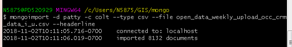

# Mongo Shell
### Doing things in the Mongo Shell

Start GitBash and enter `mongod` if it does not close your MongoDB should be running.

Open a second GitBash and type `mongo` to enter the shell.

Here are some commands from within Mongo shell
* `show dbs` this output only returns non-empty databases
* `use db_name`
* `show collections` a collection is not made until there is content in it
* `db.collection_name.find().pretty()`

Here are some commands you can run within GitBash but perhaps you would prefer to run as a [script](crt_vw.py)
* Create a collection from CSV file content
  * `mongoimport -d patty -c colt --type csv --file open_data.csv --headerline`
  
  
  
  ## Windows 7 :scream:
  * Set path with `"C:\Program Files\MongoDB\Server\4.0\bin\mongod.exe" --dbpath "C:\Program Files\MongoDB\Server\4.0\data"`
